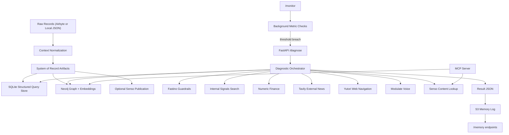
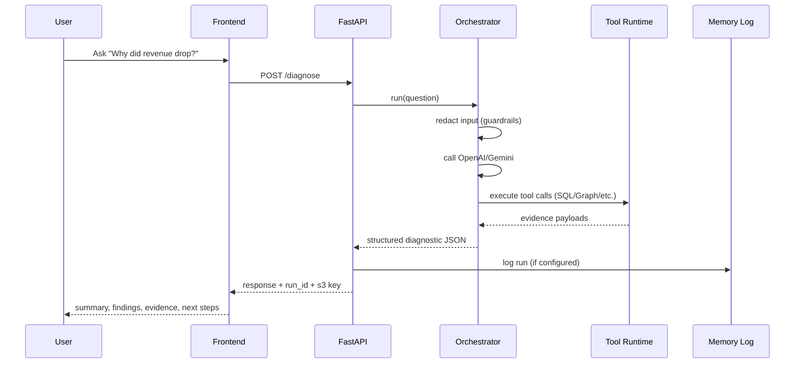
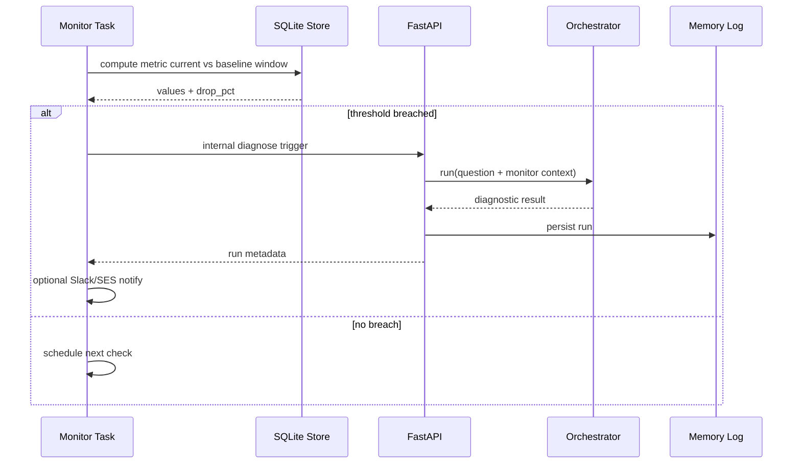

# Silo Smasher: Complete System Deep Dive

## 1. What This Tool Actually Does

Silo Smasher is an **agentic incident-response system** for engineering and support teams.

It is built to answer:
- "Why did this service degrade?"

Not just:
- "What is the current alert state?"

At runtime, it combines multiple evidence sources:
- Structured events and aggregations (SQL over normalized data)
- Relationship context (Neo4j GraphRAG)
- Internal incident signals (local Slack/Jira war-room style dataset)
- External world/provider signals (cloud/vendor status context)
- Risk classification support
- Optional voice intent/stress handling

The output is a structured diagnostic brief with:
- incident summary
- hypotheses + support/reject status
- confidence
- root-cause recommendation
- mitigation actions and next queries

## 2. High-Level Architecture

## 3. Core Runtime Modes

### 3.1 Manual diagnosis mode
Entry point:
- `POST /diagnose`

Flow:
1. Receive user question.
2. Run guardrail redaction on prompt text.
3. Try model providers in order (OpenAI primary, Gemini fallback if enabled).
4. Let the model call tools iteratively.
5. Return structured brief.
6. Persist result to S3 memory log (if configured).

### 3.2 Proactive monitoring mode
Entry points:
- `POST /monitor`
- `GET /monitor`
- `GET /monitor/{id}`
- `POST /monitor/{id}/check`
- `DELETE /monitor/{id}`

Flow:
1. A monitor definition is created (metric, threshold, interval).
2. Background task periodically computes current window vs baseline window.
3. If drop threshold is breached, monitor auto-runs diagnosis.
4. Auto-run result is logged to memory (S3) and optional Slack/SES notifications are sent.

### 3.3 Async pipeline mode (AWS Step Functions)
Entry points:
- `POST /pipeline`
- `GET /pipeline/{execution_arn}`

State machine stages:
1. IngestData
2. BuildContext
3. SyncGraph
4. RunDiagnosis
5. LogMemory

## 4. API Layer (FastAPI)

Main service file:
- `api/main.py`

What it hosts:
- Health and infra status
- Synchronous diagnosis
- Memory log read APIs
- Monitoring APIs
- Step Functions trigger/poll APIs
- Frontend static assets (`frontend/dist`)

Important behavior:
- Frontend and backend are deployed together in one web service.
- The same API process serves `/` plus `/diagnose`, `/monitor`, etc.

## 5. Orchestrator Internals

Main files:
- `src/silo_smasher/orchestrator/agent.py`
- `src/silo_smasher/orchestrator/tools.py`
- `src/silo_smasher/orchestrator/config.py`

### 5.1 Provider routing
Configured by env:
- `ORCHESTRATOR_PRIMARY_PROVIDER` (`openai` or `gemini`)
- `ORCHESTRATOR_ENABLE_GEMINI_FALLBACK`

Default behavior:
- OpenAI first
- Gemini second (if fallback enabled)

### 5.2 Guardrails around all tool calls
Before each tool executes:
- Action payload is checked with Fastino safety engine.
- Dangerous actions can be blocked with explicit error payload (`blocked_by_guardrails`).

Before model prompt:
- Prompt is PII-redacted.

Safety metadata is attached in response under `_safety`.

### 5.3 Model failure behavior
If model providers fail:
- If `ORCHESTRATOR_ENABLE_LOCAL_DEMO_FALLBACK=true`, return deterministic local demo diagnostic (`mode=local_demo_fallback`).
- Else return:
  - `error: all_providers_failed`
  - provider attempts
  - `fallback_response` with minimal local context guidance.

This is why the system can still demo even when API keys/quota are unavailable.

## 6. Tool Runtime: What Each Tool Does

Registered tool set lives in `DiagnosticToolRuntime`.

### 6.1 `get_incident_context_snapshot`
- Loads deterministic incident context from local JSON (`INCIDENT_CONTEXT_PATH`).
- Returns service metadata, deploy info, log excerpts, trace evidence, infra/provider events, and proposed PR details.
- Used heavily in fallback/demo mode to emulate real on-call evidence collection.

### 6.2 `run_sql_query`
- Executes read-only SQL against SQLite.
- Blocks write operations (`INSERT/UPDATE/DELETE/DROP/...`).
- Limits rows.
- Uses normalized local commerce tables (`users`, `products`, `purchases`, `purchase_events_enriched`).

### 6.3 `query_graph_connections`
- Embeds question text with Bedrock.
- Finds nearest retrievable nodes in Neo4j vector index.
- Expands local graph paths and renders "why connected" edges.
- Also returns customer→order→ticket link chains when available.
- If graph unavailable, falls back to latest local system-of-record manifest/context preview.

### 6.4 `get_senso_content`
- Fetches verified content by content id from Senso.
- On failure (missing key/API error), falls back to local latest context and optional mock payload.

### 6.5 `get_latest_system_record_entries`
- Reads local `manifest.jsonl` entries.
- Optionally includes mini context preview (record counts + metrics).

### 6.6 `fetch_portal_report_with_web_navigation` (Yutori)
- Creates browser automation task to inspect internal portal.
- Polls until completed/failed/timeout.
- Returns task result payload.
- If unavailable: returns local context summary fallback and optional mock payload.

### 6.7 `analyze_revenue_variance` (Numeric)
- Sends current/prior revenue and optional context.
- Returns classification + CFO-style explanation.
- Fallback heuristic classifies by materiality and baseline trend.
- Optional deterministic mock payload overlays fallback.

### 6.8 `search_external_economic_news` (Tavily)
- Runs external news/economic search with time-window mapping.
- Normalizes answer + result list.
- On failure: returns local fallback suggestion list and optional mock results.

### 6.9 `search_internal_communications`
- Searches local JSON messages (`data/internal_signals/incident_war_room_messages.json`).
- Keyword scoring with incident-term boosts.
- Supports channel filter and lookback window.
- Returns matched messages + follow-up suggestions.

### 6.10 `analyze_voice_command_mode` (Modulate)
- Detects intent/emotion/stress and picks summary vs deep-dive mode.
- Falls back to local heuristic when API unavailable.
- Optional mock response included when mock mode is enabled.

## 7. Data Foundations

## 7.1 Normalization (System of Record)
Main file:
- `src/silo_smasher/context/normalize.py`

Input:
- Raw bundle with `users`, `products`, `purchases`

Output:
- Canonical context document with:
  - schema/version metadata
  - normalized entities
  - computed facts/metrics (`net_revenue`, `conversion_rate`, `return_rate`, etc.)

## 7.2 Ground-truth artifact pipeline
Main file:
- `src/silo_smasher/pipeline/ground_truth.py`

Writes:
- `data/system_of_record/raw_snapshots/*.json`
- `data/system_of_record/agent_context/*.json`
- `data/system_of_record/manifest.jsonl`
- `data/system_of_record/sqlite/commerce.db`

Optional publish:
- Pushes raw + context to Senso and verifies context hash parity.

## 8. GraphRAG Layer

Main files:
- `src/silo_smasher/graph/store.py`
- `src/silo_smasher/graph/graphrag.py`
- `src/silo_smasher/graph/bedrock_embedder.py`
- `src/silo_smasher/graph/config.py`

Ingestion:
- Upserts Customer/Product/Order/SupportTicket nodes.
- Creates key constraints.
- Creates vector index for retrievable nodes.
- Embeds descriptive text using Bedrock model.

Retrieval:
1. Embed user question.
2. Vector seed lookup in Neo4j.
3. Multi-hop path expansion.
4. Relationship reason rendering.

This is why the output can explain *why entities are connected*, not just nearest text similarity.

## 9. Memory and Auditability

Main file:
- `src/silo_smasher/memory/s3_logger.py`

Every diagnosis can be written as:
- `s3://<bucket>/<prefix>/<YYYY>/<MM>/<DD>/<run_id>.json`

Contains:
- run id
- timestamp
- user question
- full result payload

Endpoints:
- `GET /memory`
- `GET /memory/{key}`

Purpose:
- Operational traceability
- Review past runs
- Grounded audit log for demos and debugging

## 10. Proactive Monitoring Internals

Main files:
- `src/silo_smasher/monitoring/config.py`
- `src/silo_smasher/monitoring/service.py`

Monitored metrics:
- `net_revenue`
- `gross_revenue`
- `purchased_count`
- `returned_count`
- `conversion_rate`
- `return_rate`

Aliases:
- `mrr`, `revenue`, `sales` -> `net_revenue`

Computation logic:
- Compare current time window vs previous baseline window.
- Compute drop percent.
- Trigger only on edge transition into breached state (avoids retrigger spam every tick).

Auto-trigger payload enrichment:
- monitor id/config
- measured values
- time windows
- snapshot details

Notifications (optional):
- Slack webhook post
- AWS SES email

## 11. MCP Server Exposure

Main files:
- `mcp/server.py`
- `mcp/README.md`

Exposed MCP tools:
- `query_graph_connections`
- `get_senso_content`

Transports:
- `stdio`
- `sse`
- `streamable-http`

This lets external MCP hosts use Silo Smasher as a data-intelligence backend.

## 12. Frontend Behavior

Main files:
- `frontend/src/App.jsx`
- `frontend/src/components/ChartsFocusPanel.jsx`
- `frontend/src/components/InvestigatePanel.jsx`
- `frontend/src/components/GuideModal.jsx`

UX model:
- Charts and key metrics are primary.
- A compact chat dock opens expanded diagnostic panel on demand.
- Diagnostic panel submits to `/diagnose` and renders:
  - summary
  - findings
  - evidence (SQL + internal signals)
  - next steps

Important:
- Frontend normalizes fallback payloads so demo flow still renders when provider APIs fail.

## 13. Fallback Strategy (Critical for Demo Reliability)

The system is explicitly built with layered fallback.

### 13.1 Provider-level fallback
- OpenAI -> Gemini -> local demo fallback (if enabled).

### 13.2 Tool-level fallback
- Numeric/Tavily/Yutori/Modulate/Senso all have local fallback paths.
- `SPONSOR_MOCK_DATA_ENABLED=true` adds deterministic mock payloads on top, so UI remains rich.

### 13.3 Data bootstrap fallback
- SQL layer bootstraps from latest manifest snapshot.
- If none exists, falls back to `examples/synthetic_raw_bundle.json`.

### 13.4 Deployment fallback
- Frontend static serving falls back from `frontend/dist` to `frontend/` in local dev.

## 14. Environment Variables: Practical Grouping

For baseline local demo (no live sponsor APIs):
- `ORCHESTRATOR_ENABLE_LOCAL_DEMO_FALLBACK=true`
- `SPONSOR_MOCK_DATA_ENABLED=true`

For real model reasoning:
- `OPENAI_API_KEY` (primary)
- `GEMINI_API_KEY` (backup)

For graph retrieval:
- `NEO4J_URI`, `NEO4J_USERNAME`, `NEO4J_PASSWORD`
- `AWS_ACCESS_KEY_ID`, `AWS_SECRET_ACCESS_KEY`, `AWS_REGION`

For system-of-record verification:
- `SENSO_API_KEY`

For proactive alert delivery:
- `MONITOR_SLACK_WEBHOOK_URL`
- `MONITOR_SES_FROM_EMAIL`
- `MONITOR_SES_TO_EMAIL`

For memory logging:
- `AWS_S3_MEMORY_BUCKET`

For async pipeline:
- `AWS_STEP_FUNCTIONS_STATE_MACHINE_ARN`

See full defaults in `.env.example`.

## 15. Common Operational Questions

### Q1: Why do I see `all_providers_failed`?
Because both configured model providers failed and local demo fallback is disabled.

Fix:
- enable `ORCHESTRATOR_ENABLE_LOCAL_DEMO_FALLBACK=true`, or
- restore provider keys/quota.

### Q2: Why does graph tool return local fallback?
Neo4j or Bedrock embedding call failed (credentials/network/index missing).

Fix:
- verify Neo4j creds + AWS Bedrock region/model access.

### Q3: Why does diagnosis still work without sponsor keys?
By design:
- each sponsor client has fallback behavior,
- mock mode injects deterministic payloads,
- local demo fallback can bypass model outages.

### Q4: Why no real Slack/Jira data yet?
Current internal-signal path is local synthetic JSON for demo reliability and zero external dependency.

## 16. What Is Fully Implemented vs Simulated

Implemented in code and active:
- Full REST API
- Orchestrator with tool-calling loop
- SQL tool
- GraphRAG integration
- Senso integration + fallback
- Numeric/Tavily/Yutori/Modulate integrations + fallback
- Internal synthetic signal search
- Memory logs
- Proactive monitors
- MCP server exposure
- Frontend charts + diagnostic flow

Still simulated unless corresponding real keys/workspace are configured:
- Live sponsor outputs for some providers
- Real internal Slack/Jira source ingestion

## 17. End-to-End Lifecycle (Manual)

## 18. End-to-End Lifecycle (Proactive)

## 19. Recommended Reading Order in Code

If you want to understand the system fastest, read in this order:
1. `api/main.py`
2. `src/silo_smasher/orchestrator/agent.py`
3. `src/silo_smasher/orchestrator/tools.py`
4. `src/silo_smasher/structured_query/store.py`
5. `src/silo_smasher/graph/store.py` + `graphrag.py`
6. `src/silo_smasher/monitoring/service.py`
7. `src/silo_smasher/memory/s3_logger.py`
8. `mcp/server.py`
9. `frontend/src/App.jsx` + `components/*`

## 20. Bottom Line

Silo Smasher is a resilient diagnostic runtime, not a thin dashboard.

Its design principle is:
- **Always return a grounded, inspectable answer**
- even when one or more providers are unavailable.

That reliability comes from:
- layered fallbacks,
- local system-of-record artifacts,
- SQL + graph + signal correlation,
- and persistent memory logs for traceability.
